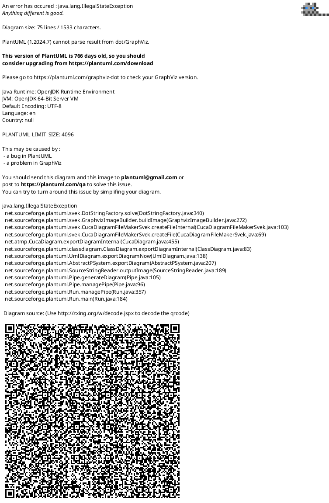
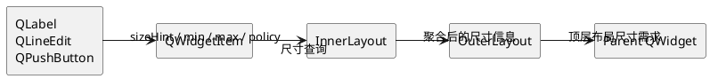

# Qt 布局计算：尺寸需求汇总到 Geometry 分配

Qt Widgets 的布局计算可以拆成两个方向相反的阶段：

```text
尺寸需求：由内向外汇总
实际 Geometry：由外向内分配
```

前者决定界面在理想、最小和最大情况下需要的尺寸；后者在父容器已拥有实际空间后，为每个子项计算最终 `QRect`。`sizeHint()`、最小/最大尺寸、`QSizePolicy`、stretch 和 `QLayout::SizeConstraint` 分别参与其中。

## 1. 对象模型：QWidget、QLayout 与 QLayoutItem

`QWidget` 是可视对象，`QLayout` 是几何管理器；两者没有继承关系。`QLayout` 同时继承 `QObject` 和 `QLayoutItem`，因此一个嵌套布局可以作为父布局中的布局项。

`QLayoutItem` 是布局系统的统一抽象。布局通过它查询尺寸信息并设置几何区域。常见实现包括：

| 类型 | 表示的对象 |
| --- | --- |
| `QWidgetItem` | 一个 `QWidget` 的适配项 |
| `QLayout` | 一个嵌套布局 |
| `QSpacerItem` | 一个不对应可视控件的空白项 |

下面的类图刻意省略了具体布局类型，例如 `QHBoxLayout`、`QVBoxLayout` 和 `QGridLayout`；它们都从 `QLayout` 派生，主要差异在于各自的空间分配算法。



图中的成员用于表达稳定的概念关系。Qt 的实际存储依赖私有实现类，具体字段名与容器类型不应视为公开 API。

### QWidgetItem 的职责与生命周期

`QWidgetItem` 是 `QWidget` 进入布局系统的适配层。调用 `layout->addWidget(widget)` 时，布局会创建一个内部 widget item，并将其保存为布局项；在当前 Qt 6 实现中，默认创建的是带尺寸缓存的内部 `QWidgetItemV2`。

它的职责包括：

- 向布局提供控件的推荐、最小和最大尺寸；
- 根据 `QSizePolicy` 报告可扩张方向；
- 支持 `heightForWidth()` 等高宽联动信息；
- 在布局完成计算后，将分配到的矩形应用到 QWidget；
- 在控件隐藏时，作为空布局项参与相应处理。

`QWidgetItem` 不属于 QObject 对象树。它由布局拥有：布局销毁时会删除 item；调用 `takeAt()` 后，item 的删除责任转移给调用方。删除 `QWidgetItem` 不会删除其包装的 `QWidget`，后者仍由 QObject 父子关系或应用代码负责生命周期。

## 2. 尺寸需求：由内向外汇总

布局首先需要知道“界面需要多大”。叶子控件会提供以下信息：

| 接口或属性 | 含义 |
| --- | --- |
| `sizeHint()` | 理想情况下的推荐尺寸 |
| `minimumSizeHint()` | 正常显示所需的最低推荐尺寸 |
| `minimumSize()` | 显式设置的硬性下限 |
| `maximumSize()` | 显式设置的硬性上限 |
| `sizePolicy()` | 围绕推荐尺寸的伸缩偏好 |

例如，按钮的 `sizeHint()` 一般与文本、字体、图标和样式边距有关。若自定义控件的内容变化会影响这些尺寸，应调用 `updateGeometry()` 通知父布局重新计算。

内层布局会将子项信息汇总成自身的 `minimumSize()`、`sizeHint()`、`maximumSize()` 和 `expandingDirections()`；外层布局再把内层布局视为一个 `QLayoutItem`，继续向上汇总。



以垂直布局为例，可以用简化模型理解：布局高度接近各子项高度之和，再加上 `spacing` 和上下 `contentsMargins`；布局宽度接近子项宽度需求的最大值，再加上左右边距。实际算法还需要处理 stretch、最大最小尺寸、对齐和 `heightForWidth()`，因此这不是严格公式。

## 3. SizeConstraint：将布局需求施加给父容器

顶层布局汇总出整体尺寸后，`QLayout::SizeConstraint` 决定这些结果如何影响布局的父 `QWidget`。它约束的是父容器，而不是直接决定各子控件如何瓜分空间。

| SizeConstraint | 对父 QWidget 的影响 |
| --- | --- |
| `SetNoConstraint` | 不由该布局主动设置尺寸约束 |
| `SetDefaultConstraint` | 默认行为；通常保证父控件至少能容纳布局 |
| `SetMinimumSize` | 最小尺寸取布局的 `minimumSize()` |
| `SetFixedSize` | 尺寸固定为布局的 `sizeHint()` |
| `SetMaximumSize` | 最大尺寸取布局的 `maximumSize()` |
| `SetMinAndMaxSize` | 同时设置最小和最大尺寸 |

因此，`SizeConstraint` 的位置可以概括为：

```text
叶子控件尺寸信息
    -> 内层布局汇总
    -> 外层布局汇总
    -> 顶层布局的 min / hint / max
    -> SizeConstraint
    -> 父 QWidget 的尺寸边界
```

例如，`SetFixedSize` 固定的是父窗口的尺寸范围，而不是把其中的所有子控件改为 `Fixed`。即使子控件使用 `Expanding`，它也只能在这个固定窗口已经提供的范围内扩张。

## 4. Geometry 分配：由外向内执行

父窗口显示、调整大小，或布局因内容变化失效后，顶层布局会获得父容器的当前矩形。随后，空间沿布局层级向内分配：外层布局先计算子项矩形，嵌套布局接收自己的矩形后，再继续计算内部子项。

```plantuml
@startuml
left to right direction
skinparam linetype ortho

participant "Parent QWidget" as Parent
participant "OuterLayout" as Outer
participant "InnerLayout" as Inner
participant "QWidgetItem" as Item
participant "Child QWidget" as Widget

Parent -> Outer : setGeometry(parentRect)
Outer -> Outer : 扣除 margins、spacing\n计算各布局项 QRect
Outer -> Inner : setGeometry(innerRect)
Inner -> Inner : 计算内部子项 QRect
Inner -> Item : setGeometry(widgetRect)
Item -> Widget : 应用最终 geometry
@enduml
```

`QWidgetItem::setGeometry()` 是从布局项矩形到控件实际矩形的关键落点。它并非总是直接将 layout item 的 `QRect` 原样交给 QWidget；最大尺寸、对齐方式和 `heightForWidth()` 都可能使控件最终使用的区域更小或形状不同。

### QSizePolicy 与 stretch

`QSizePolicy` 描述控件相对 `sizeHint()` 的伸缩偏好。七种策略由四个 flag 组成：

| PolicyFlag / Policy | Fixed | Minimum | Maximum | Preferred | Expanding | MinimumExpanding | Ignored |
| --- | ---: | ---: | ---: | ---: | ---: | ---: | ---: |
| `GrowFlag` |  | ✓ |  | ✓ | ✓ | ✓ | ✓ |
| `ExpandFlag` |  |  |  |  | ✓ | ✓ |  |
| `ShrinkFlag` |  |  | ✓ | ✓ | ✓ |  | ✓ |
| `IgnoreFlag` |  |  |  |  |  |  | ✓ |

- `GrowFlag`：允许超过 `sizeHint()`；
- `ShrinkFlag`：允许低于 `sizeHint()`；
- `ExpandFlag`：希望获得额外空间；
- `IgnoreFlag`：忽略 `sizeHint()`。

其中需要特别区分：

```text
Expanding = GrowFlag | ShrinkFlag | ExpandFlag
Ignored   = GrowFlag | ShrinkFlag | IgnoreFlag
```

`Ignored` 不包含 `ExpandFlag`。它表达的是“不以 `sizeHint()` 作为主要分配依据”，而不是“主动要求更多空间”。因此，同一布局中若没有显式 stretch，一个 `Ignored` 项可能比 `Expanding` 项占用更小区域。

stretch 解决的是多个布局项之间的剩余空间比例；`QSizePolicy` 则表达控件是否允许收缩、增长，以及是否具有扩张意愿。两者还要同时受到 `minimumSize`、`maximumSize`、边距、间距、对齐和布局类型的约束。

## 结语

Qt 布局计算不是一次简单的 `setGeometry()` 调用，而是递归的双向过程：

```text
向上：QWidget -> QWidgetItem -> 内层 QLayout -> 外层 QLayout
      汇总 minimumSize、sizeHint、maximumSize 等尺寸需求

中间：SizeConstraint 将顶层布局需求转化为父 QWidget 的尺寸边界

向下：父 QWidget -> 外层 QLayout -> 内层 QLayout -> QWidgetItem -> QWidget
      分配并应用最终 Geometry
```

可以将各对象的职责归纳为：

- `QWidget`：提供内容相关的尺寸信息，并承接最终 Geometry；
- `QWidgetItem`：将 QWidget 适配为布局项，负责尺寸查询与 Geometry 落地；
- `QLayoutItem`：布局系统处理控件、子布局和 spacer 的统一接口；
- `QLayout`：汇总尺寸需求、应用父容器约束，并向下分配空间；
- `QSizePolicy`：描述子项围绕 `sizeHint()` 的伸缩偏好；
- `SizeConstraint`：决定布局尺寸需求如何约束父 QWidget。

理解这条链路后，布局问题通常可以按同一顺序定位：先检查控件尺寸输入，再检查布局汇总结果和父容器约束，最后检查 `sizePolicy`、stretch 与实际 Geometry 分配。

## 参考资料

- [QLayout Class](https://doc.qt.io/qt-6/qlayout.html)
- [Layout Management](https://doc.qt.io/qt-6/layout.html)
- [QLayoutItem Class](https://doc.qt.io/qt-6/qlayoutitem.html)
- [QWidgetItem Class](https://doc.qt.io/qt-6/qwidgetitem.html)
- [QSizePolicy Class](https://doc.qt.io/qt-6/qsizepolicy.html)
- [Qt 6 source: qlayout.cpp](https://codebrowser.dev/qt6/qtbase/src/widgets/kernel/qlayout.cpp.html)
- [Qt 6 source: qlayoutitem.cpp](https://codebrowser.dev/qt6/qtbase/src/widgets/kernel/qlayoutitem.cpp.html)
